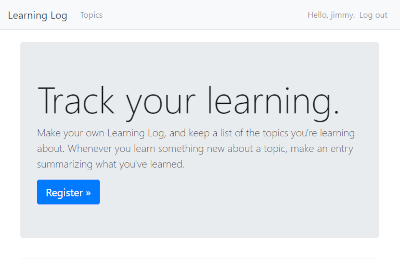

# Learning Log

A simple Django / SQLite application, written for the purposes of ramping-up
with Python and Django and reminding myself of the core concepts.

## Project Setup Instructions
This project is implemented in the Python Programming Language
The following are the steps required to download and  

### Download the application
- Install Python >= 3.9
  - 3.10 confirmed working
- Fetch contents of this project:
  - `git init`
  - `git pull https://github.com/jhaslam/learning_log.git`
- Create and activate this project's development environment:
  - create: `python -m venv project_env`
  - activate:
    - From UNIX / Bash / Zsh: `source ./project_env/Scripts/activate`
    - From Windows / Powershell: `.\project_env\Scripts\activate`
- Fetch this project's dependency closure:
  - `pip install -r requirements.txt`

### Initialize the Database
First time setup:
- `python manage.py makemigrations learning_logs`
- `python manage.py migrate`

### Create an admin user
- `python manage.py createsuperuser`

### Start the Development Server in your Local Dev Environment
- `python manage.py runserver`

### Visit the admin console
- [`http:\\localhost:8000\admin`](http:\\localhost:8000\admin)
- Add a topic and some topic entries

### Visit the main app page
- [`http:\\localhost:8000`](http:\\localhost:8000)
